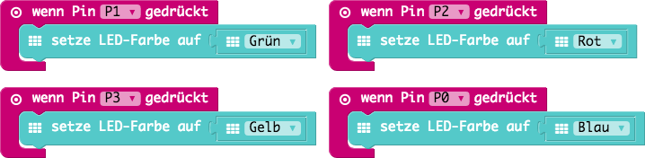

# Calliope Mini Workshop für Devoxx4Kids

Dieser Workshop ist für eine Dauer von etwa 90 Minuten  zusammengestellt.

## Aufgaben

### 1. Hello World!

Schreibt eure Namen auf die LED Matrix.

#### Beispiel

|Code|HEX|
|-|-|
|[01_hello-world/01_hello-world.js](01_hello-world/01_hello-world.js)|[01_hello-world/01_hello-world.hex](01_hello-world/01_hello-world.hex)|

### 2. Spiele ein kleines Lied 

Baue eine kleine Melodie für den Calliope

#### Beispiel

|Code|HEX|
|-|-|
|[02_music/02_music.js](02_music/02_music.js)|[02_music/02_music.hex](02_music/02_music.hex)|

### 3. Farbe mit den Fingern verändern

Durch Berührung kannst du den Calliope steuern

#### Beispiel

|Code|HEX|
|-|-|
|[03_touch/03_touch.js](03_touch/03_touch.js)|[03_touch/03_touch.hex](03_touch/03_touch.hex)|

### 4. Calliope Klavier

Nutze die Möglichkeiten aus den beiden Aufgaben zuvor und baue ein Klavier, sodass wenn man eine Taste ein Ton erklingt.

#### Beispiel

|Code|HEX|
|-|-|
|[04_piano/04_piano.js](04_piano/04_piano.js)|[04_piano/04_piano.hex](04_piano/04_piano.hex)|

### 5. Lautstärke messen

Ganz schön laut hier drin? Lass uns mit den Calliope die Lautstärke messen!

In dieser Aufgabe lernst du das erste Mal *Platzhalter* und den *Mikrofon*-Eingang kennen.

#### Beispiel

|Code|HEX|
|-|-|
|[05_noise/05_noise.js](05_noise/05_noise.js)|[05_noise/05_noise.hex](05_noise/05_noise.hex)|

### 6. Lautstärke-Ampel

Immer wenn es uns zu laut wird wollen wir das mit dem Calliope anzeigen können.

In diesen Beispiel verwenden wir das erste Mal eine *Bedingung* (Wenn...Dann...Ansonsten...)

#### Beispiel

|Code|HEX|
|-|-|
|[06_noise-light/06_noise-light.js](06_noise-light/06_noise-light.js)|[06_noise-light/06_noise-light.hex](06_noise-light/06_noise-light.hex)|

### 6. Der Kompass im Calliope

Der Calliope kann dir die Rechtung weisen. Dafür hat er einen Kompass eingebaut.
Achtung! Der Kompass muss zunächst kalibiert werden damit er richtig funktionieren kann.

#### Beispiel

|Code|HEX|
|-|-|
|[07_compass/07_compass.js](07_compass/07_compass.js)|[07_compass/07_compass.hex](07_compass/07_compass.hex)|

### 7. Helligkeit messen

TODO: Der Calliope kann messen wie hell es ist.

#### Beispiel

|Code|HEX|
|-|-|
|[07_light/07_light.js](07_light/07_light.js)|[07_light/07_light.hex](07_light/07_light.hex)|

## Weitere mögliche Aufgaben

* Morsen
* Helligkeitsmessung
* Temperaturmessung

## Quellen

* [Calliope Mini Website](https://calliope.cc)
* [Microsoft MakeCode (PXT - Programming eXperience Toolkit) für Calliope Mini](https://makecode.calliope.cc/)
* [Calliope Challenge-Karten der PH Zürich](https://phzh.ch/globalassets/phzh.ch/medienbildung/dokumente/calliope_challenge_cards.pdf)
* [Schulmaterial von Cornelsen](https://calliope.cc/schulen/schulmaterial)
* [Sender & Receiver Beispiel](https://boris.muehmer.net/2017/06/03/calliope-bluetooth-sender-receiver.html)