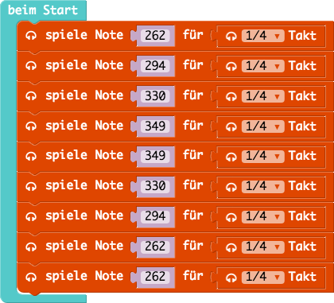

# calliope workshop d4k

## 1. Hello World!

Schreibt eure Namen auf die LED Matrix

### Beispiel

[Code](01_hello-world/01_hello-world.js)

[HEX](01_hello-world/01_hello-world.hex)

## 2. Spiele ein kleines Lied 

Baue eine kleine Melodie für den calliope

### Beispiel

[Code](02_music/02_music.js)

[HEX](02_music/02_music.hex)

## 3. Farbe mit den Fingern verändern

Durch Berührung kannst du den Calliope steuern

### Beispiel

[Code](03_touch/03_touch.js)

[HEX](03_touch/03_touch.hex)

