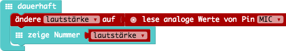
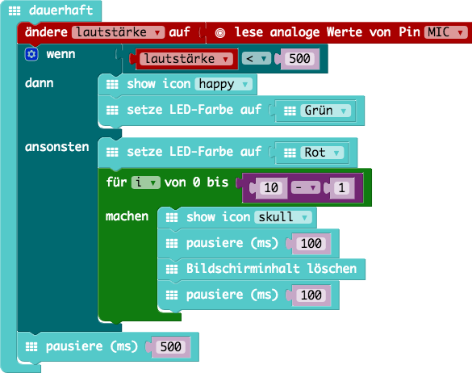

# Calliope Mini Workshop


In diesem Workshop werden spielerisch erste Erfahrungen mit einfachen Programmierkonzepten auf Basis des Calliope Minis erarbeitet. 

Der Workshop ist für eine Dauer von etwa 90 Minuten zusammengestellt. Es sind immer zwei Kinder und ein Mentor pro Calliope Mini gedacht.

## Voraussetzungen

### Editor

Es kann entweder eine Online Editor verwendet werden: [https://makecode.calliope.cc/](https://makecode.calliope.cc/)

Alternativ ist auch möglich lokal einen Editor zu nutzen (keine Internetverbindung notwendig). Dafür muss zuvor folgendes Projekt aufgesetzt werden: [https://github.com/calliope-mini/pxt-calliope-static](https://github.com/calliope-mini/pxt-calliope-static)

### Hardware

* Ein Calliope Mini :-)
* Für den Einsatz des Editors sollte man mindestens einen Raspberry Pi 3 nutzen (Performance).

## Aufgaben

### 1. Hello World!

Schreibt eure Namen mit dem Calliope. Verwende dafür die LED Matrix!

#### Beispiel

|Code|HEX|
|-|-|
|[01_hello-world/01_hello-world.js](01_hello-world/01_hello-world.js)|[01_hello-world/01_hello-world.hex](01_hello-world/01_hello-world.hex)|


### 2. Spiele ein kleines Lied 

Es ist auf dem Calliope ein Lautsprecher verbaut. Baue eine kleine Melodie für den Calliope.

#### Beispiel

|Code|HEX|
|-|-|
|[02_music/02_music.js](02_music/02_music.js)|[02_music/02_music.hex](02_music/02_music.hex)|


### 3. Farbe mit den Fingern verändern

In dieser Aufgabe lernst du die *Sternspitzen (Pins)* des Calliope kennen.

Durch Berührung kannst du den Calliope steuern. Ändere die Farbe der RGB-LED durch deine Berührung.

*Hinweis:* Es muss immer auch gleichzeitig "GND" bzw. die mit "-" gekennzeichnete Sternspitze berührt werden!

#### Beispiel

|Code|HEX|
|-|-|
|[03_touch/03_touch.js](03_touch/03_touch.js)|[03_touch/03_touch.hex](03_touch/03_touch.hex)|


### 4. Calliope Klavier

Nutze die Möglichkeiten aus den beiden vorherigen Aufgaben und baue ein Klavier, sodass beim Drücken einer Taste ein Ton erklinkt.

#### Beispiel

|Code|HEX|
|-|-|
|[04_piano/04_piano.js](04_piano/04_piano.js)|[04_piano/04_piano.hex](04_piano/04_piano.hex)|


### 5. Lautstärke messen

Ganz schön laut hier drin? Lass uns mit den Calliope die Lautstärke messen!

In dieser Aufgabe lernst du das erste Mal *Platzhalter* und den *Mikrofon*-Eingang kennen.

#### Beispiel

|Code|HEX|
|-|-|
|[05_noise/05_noise.js](05_noise/05_noise.js)|[05_noise/05_noise.hex](05_noise/05_noise.hex)|




### 6. Lautstärke-Ampel

Immer wenn es uns zu laut wird wollen wir das mit dem Calliope anzeigen.

In diesen Beispiel verwenden wir das erste Mal eine *Bedingung* (Wenn...Dann...Ansonsten...)

#### Beispiel

|Code|HEX|
|-|-|
|[06_noise-light/06_noise-light.js](06_noise-light/06_noise-light.js)|[06_noise-light/06_noise-light.hex](06_noise-light/06_noise-light.hex)|



### 7. Der Kompass im Calliope

Der Calliope kann dir die Richtung weisen. Dafür hat er einen Kompass eingebaut.
Was ist ein Kompass? Und wie funktioniert er? Was sind 1 bis 360°?

#### Analoges Signal

Bei einem analogen Input liefert der Sensor Messdaten mit einem kontinuierlichen Wertebereich. Beim Kompass ist dies beispielsweise ein Wertebereich von 1° bis 360°. Ein analoger Input wie der Kompass kann also 360 verschiedene Werte messen. 


#### Achtung!

Der Kompass muss zunächst kalibriert werden damit er richtig funktionieren kann. Für die Kalibrierung zeigt der Calliope auf der LED-Matrix einen Kreis an den man durch Bewegung in alle Richtungen komplettieren muss.

#### Teil 1

Zeige die Werte des Kompasses auf dem LED-Display an. Drehe den Calliope in jede Richtung und zeichne die Werte auf einem Blatt Papier auf.

#### Teil 2

Teile den Wertebereich von 0 bis 360° in acht Teile auf und Zeichne für jeden Wertebereich einen Pfeil in die jeweilige Richtung auf der LED-Matrix. 

##### Rechenbeispiel

Wenn der Kompass nach Norden zeigt muss der gemessene Wert zwischen 338 und 23° liegen. 

Die Rechnung dahinter:
Bei 0° zeigt der Kompass direkt nach Norden. Wenn der Wertbereich in acht Teile geteilt wird sind pro Teil 45° für den Wertebereich relevant.

```
0° - (45°/2) = -22,5° ~= 338°
0° + (45°/2) =  22,5° ~= 23°
```

##### Wertebereiche

|Richtung|Wertebereich|
|-|-|
| Nord | 338° bis 23° |
| Nordost | 23° bis 68° |
| Ost | 68° bis 113° |
| Südost | 113° bis 158° |
| Süd | 158° bis 203° |
| Südwest | 203° bis 248° |
| West | 248° bis 293° |
| Nordwest | 293° bis 338° |

#### Beispiel

|Code|HEX|
|-|-|
|[07_compass/07_compass.js](07_compass/07_compass.js)|[07_compass/07_compass.hex](07_compass/07_compass.hex)|


### 8. Geheime Nachrichten

Der Calliope kann mit anderen Calliopes sprechen. Sende einer anderen Gruppe eine geheime Nachricht.

Wichtig ist, dass ihr zuvor eine gemeinsame *Gruppe* ausmacht! 

#### Beispiel

|Code|HEX|
|-|-|
|[08_messages/sender.js](08_messages/sender.js)|[08_messages/sender.hex](08_messages/sender.hex)|
|[08_messages/receiver.js](08_messages/receiver.js)|[08_messages/receiver.hex](08_messages/receiver.hex)|

#### Sender


#### Receiver


## Quellen

* [Calliope Mini Website](https://calliope.cc)
* [Microsoft MakeCode (PXT - Programming eXperience Toolkit) für Calliope Mini](https://makecode.calliope.cc/)
* [Calliope Challenge-Karten der PH Zürich](https://phzh.ch/globalassets/phzh.ch/medienbildung/dokumente/calliope_challenge_cards.pdf)
* [Schulmaterial von Cornelsen](https://calliope.cc/schulen/schulmaterial)
* [Sender & Receiver Beispiel](https://boris.muehmer.net/2017/06/03/calliope-bluetooth-sender-receiver.html)
